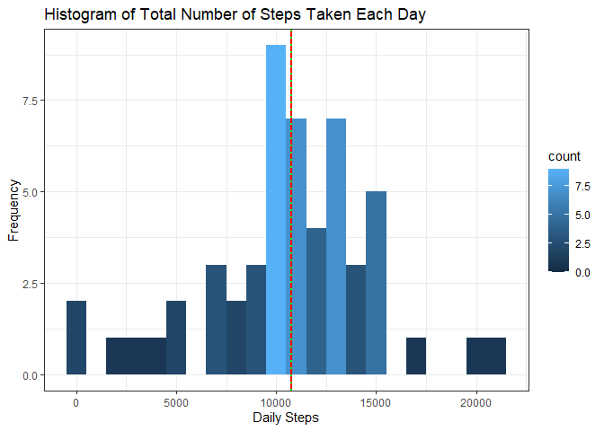
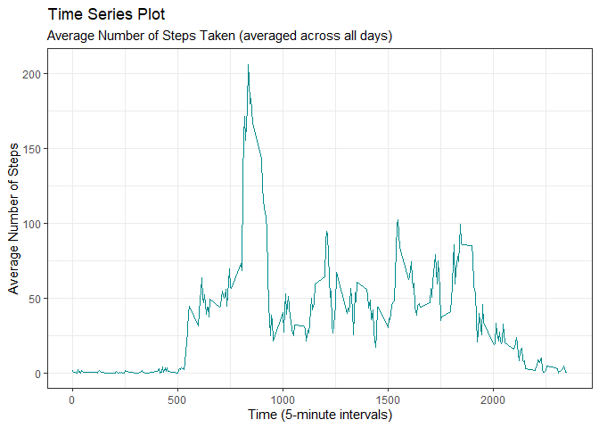
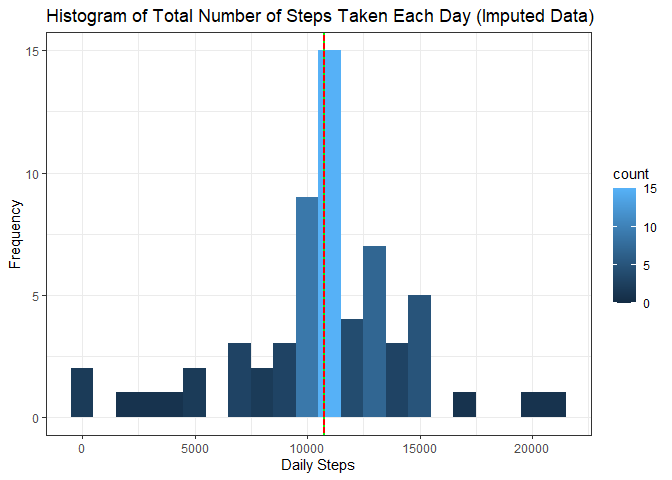
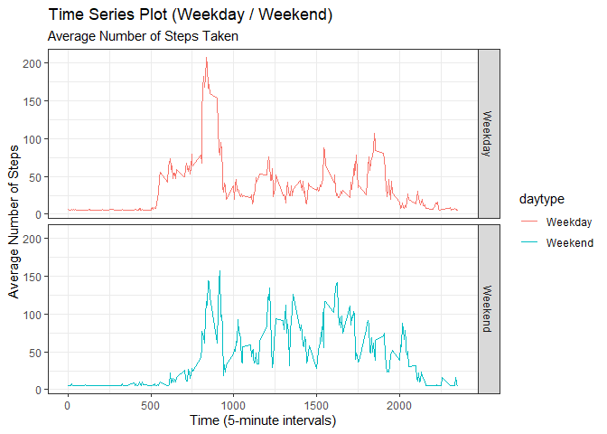

```r
knitr::opts_chunk$set(echo = TRUE, out.width = "\\textwidth", 
                      warning = FALSE, message = FALSE)

if (!require(pacman))
  install.packages("pacman")
```

```
## Loading required package: pacman
```

```r
pacman::p_load('ggplot2',
               'dplyr',
               'lubridate')
```

********************************************************************


## Loading and preprocessing the data


```r
activity <- read.csv(unz("activity.zip", "activity.csv"))

str(activity)
```

```
## 'data.frame':	17568 obs. of  3 variables:
##  $ steps   : int  NA NA NA NA NA NA NA NA NA NA ...
##  $ date    : chr  "2012-10-01" "2012-10-01" "2012-10-01" "2012-10-01" ...
##  $ interval: int  0 5 10 15 20 25 30 35 40 45 ...
```

```r
# change the class of activity$date
activity$date <- ymd(activity$date)

head(activity)
```

```
##   steps       date interval
## 1    NA 2012-10-01        0
## 2    NA 2012-10-01        5
## 3    NA 2012-10-01       10
## 4    NA 2012-10-01       15
## 5    NA 2012-10-01       20
## 6    NA 2012-10-01       25
```

```r
tail(activity)
```

```
##       steps       date interval
## 17563    NA 2012-11-30     2330
## 17564    NA 2012-11-30     2335
## 17565    NA 2012-11-30     2340
## 17566    NA 2012-11-30     2345
## 17567    NA 2012-11-30     2350
## 17568    NA 2012-11-30     2355
```

```r
sum(is.na(activity$steps))
```

```
## [1] 2304
```

```r
# remove NA cases
activity.complete.cases <- na.omit(activity)

str(activity.complete.cases)
```

```
## 'data.frame':	15264 obs. of  3 variables:
##  $ steps   : int  0 0 0 0 0 0 0 0 0 0 ...
##  $ date    : Date, format: "2012-10-02" "2012-10-02" ...
##  $ interval: int  0 5 10 15 20 25 30 35 40 45 ...
##  - attr(*, "na.action")= 'omit' Named int [1:2304] 1 2 3 4 5 6 7 8 9 10 ...
##   ..- attr(*, "names")= chr [1:2304] "1" "2" "3" "4" ...
```

```r
summary(activity.complete.cases)
```

```
##      steps             date               interval     
##  Min.   :  0.00   Min.   :2012-10-02   Min.   :   0.0  
##  1st Qu.:  0.00   1st Qu.:2012-10-16   1st Qu.: 588.8  
##  Median :  0.00   Median :2012-10-29   Median :1177.5  
##  Mean   : 37.38   Mean   :2012-10-30   Mean   :1177.5  
##  3rd Qu.: 12.00   3rd Qu.:2012-11-16   3rd Qu.:1766.2  
##  Max.   :806.00   Max.   :2012-11-29   Max.   :2355.0
```

## What is mean total number of steps taken per day?


```r
# Summarize by total number of steps taken per day
daily.steps <- summarize(group_by(activity.complete.cases,date),
                         total.steps=sum(steps))
# Calculate mean and median
daily.steps.mean <- as.integer(mean(daily.steps$total.steps))
daily.steps.median <- as.integer(median(daily.steps$total.steps))

# Create histogram
daily.steps.hist <- ggplot(daily.steps, aes(x=total.steps)) + 
  geom_histogram(binwidth = 1000, aes(y=..count.., fill=..count..)) + 
  geom_vline(xintercept=daily.steps.mean,
             colour="red",
             linetype="solid",
             size=1) +
  geom_vline(xintercept=daily.steps.median,
             colour="green" ,
             linetype="dotted",
             size=1) +
  labs(x="Daily Steps",
       y="Frequency",
       title="Histogram of Total Number of Steps Taken Each Day") +
  theme_bw()
```


```r
# Histogram of the total number of steps taken each day
daily.steps.hist
```



Mean of the total number of steps taken per day is **10766**.

Median of the total number of steps taken per day is **10765**.


## What is the average daily activity pattern?


```r
# Summarize by average number of steps taken by 5-minute interval
activity.pattern <- activity.complete.cases %>%
  group_by(interval) %>%
  summarize(avg.steps=mean(steps))

# Create Time Series Plot - average number of steps taken by 5-minute interval
time.series.plot <- ggplot(activity.pattern, aes(x=interval,y=avg.steps)) + 
  geom_line(color="darkcyan") + 
  labs(x="Time (5-minute intervals)",
       y="Average Number of Steps",
       title="Time Series Plot",
       subtitle="Average Number of Steps Taken (averaged across all days)") +
  theme_bw()

# Find out, which 5-minute interval, on average across all the days in the dataset, contains the maximum number of steps
max.steps <- which.max(activity.pattern$avg.steps)
max.steps.interval <- activity.pattern$interval[max.steps]
```


```r
# Time Series Plot - Average Number of Steps Taken (averaged across all days)
time.series.plot
```



The 5-minute interval, on average across all the days in the dataset, that contains the maximum number of steps is **835**.


## Imputing missing values


```r
# Check the total number of missing values in the dataset 
colSums(is.na(activity))
```

```
##    steps     date interval 
##     2304        0        0
```

The total number of missing values in the dataset is **2304**.

The strategy for filling in all of the missing values in the dataset is to change the <span style="color: red;">`NAs`</span> to the mean values for that 5-minute interval.


```r
# Create a new dataset that is equal to the original dataset but with the missing data filled in.
# For this, we will use the mean of steps for each 5-minute interval.
impute.activity <- activity
impute.activity$steps[is.na(impute.activity$steps)] <- mean(impute.activity$steps,na.rm=TRUE)

colSums(is.na(impute.activity))
```

```
##    steps     date interval 
##        0        0        0
```

```r
str(impute.activity)
```

```
## 'data.frame':	17568 obs. of  3 variables:
##  $ steps   : num  37.4 37.4 37.4 37.4 37.4 ...
##  $ date    : Date, format: "2012-10-01" "2012-10-01" ...
##  $ interval: int  0 5 10 15 20 25 30 35 40 45 ...
```

```r
summary(impute.activity)
```

```
##      steps             date               interval     
##  Min.   :  0.00   Min.   :2012-10-01   Min.   :   0.0  
##  1st Qu.:  0.00   1st Qu.:2012-10-16   1st Qu.: 588.8  
##  Median :  0.00   Median :2012-10-31   Median :1177.5  
##  Mean   : 37.38   Mean   :2012-10-31   Mean   :1177.5  
##  3rd Qu.: 37.38   3rd Qu.:2012-11-15   3rd Qu.:1766.2  
##  Max.   :806.00   Max.   :2012-11-30   Max.   :2355.0
```

```r
# Summarize by total number of steps taken per day
impute.daily.steps <- summarize(group_by(impute.activity,date),
                         total.steps=sum(steps))
# Calculate mean and median
impute.daily.steps.mean <- as.integer(mean(impute.daily.steps$total.steps))
impute.daily.steps.median <- as.integer(median(impute.daily.steps$total.steps))

# Create histogram
impute.daily.steps.hist <- ggplot(impute.daily.steps, aes(x=total.steps)) + 
  geom_histogram(binwidth = 1000, aes(y=..count.., fill=..count..)) + 
  geom_vline(xintercept=impute.daily.steps.mean,
             colour="red",
             linetype="solid",
             size=1) +
  geom_vline(xintercept=impute.daily.steps.median,
             colour="green" ,
             linetype="dotted",
             size=1) +
  labs(x="Daily Steps",
       y="Frequency",
       title="Histogram of Total Number of Steps Taken Each Day (Imputed Data)") +
  theme_bw()
```


```r
# Histogram of the total number of steps taken each day
impute.daily.steps.hist
```



Mean of the total number of steps taken per day is **10766**.

Median of the total number of steps taken per day is **10766**.

Impact of imputing missing data:
After imputation, the mean and median become equal. Imputing with mean values makes the histogram more normally distributed.


## Are there differences in activity patterns between weekdays and weekends?


```r
# Create a new factor variable in the dataset with two levels – “weekday” and “weekend” indicating whether a given date is a weekday or weekend day
impute.activity$daytype <- as.factor(ifelse(weekdays(impute.activity$date) %in% c("Saturday","Sunday"),
                              "Weekend",
                              "Weekday"))

# Summarize by average number of steps taken by 5-minute interval for weekday/weekend
impute.activity.daytype <- impute.activity %>%
  group_by(interval, daytype) %>%
  summarise(avg.steps=mean(steps))

# Create Time Series Plot
time.series.daytype <- ggplot(impute.activity.daytype, aes(x=interval, y=avg.steps, color=daytype)) + 
  facet_grid(daytype ~ .) +
  geom_line() + 
  labs(x="Time (5-minute intervals)",
       y="Average Number of Steps",
       title="Time Series Plot (Weekday / Weekend)",
       subtitle="Average Number of Steps Taken") +
  theme_bw()

time.series.daytype
```


